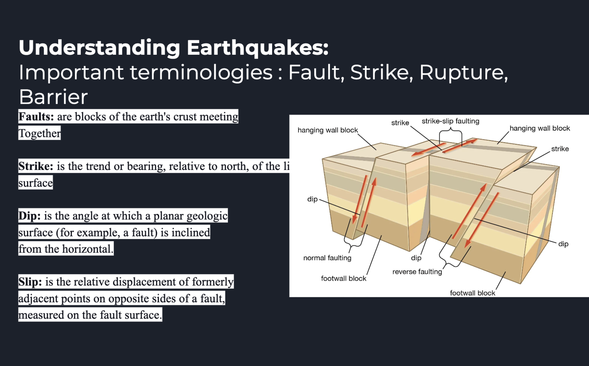
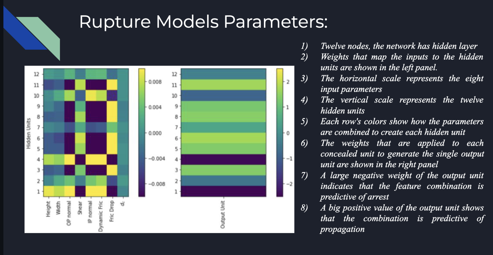
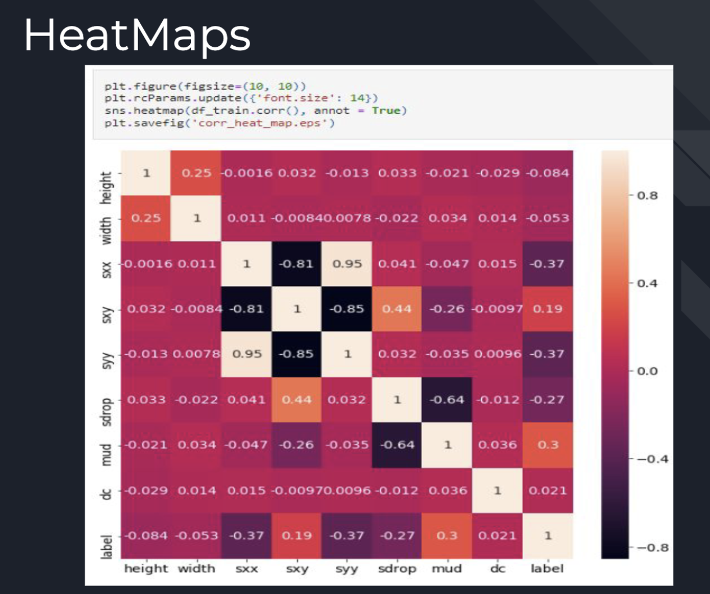
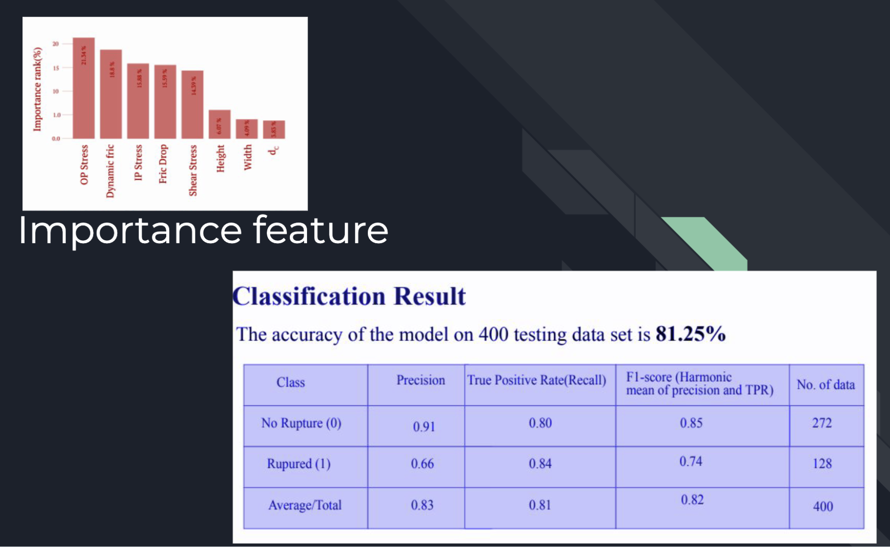

## Earthquake-Rupture

## Aim

Dynamic rupture progression is uncertain due to factors like
fault, slip, strike, stress condition, friction of fault

By using Machine learning we predict if the rupture can break the fault

Artificial Neural Network
Random Forest Classification

## Definition

## Neural Network

## HeatMaps

## Accuracy

